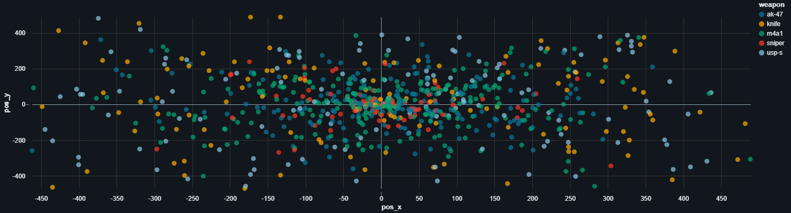
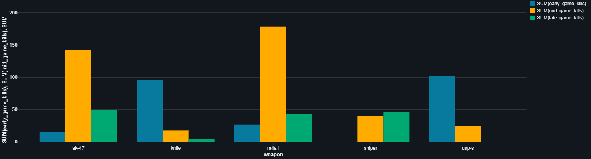
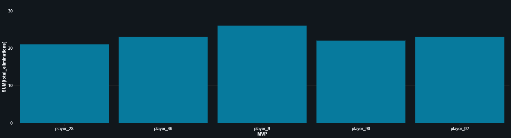

# Cloud Game Data Collector

A real-time data engineering pipeline built to simulate, ingest, and process telemetry data from a 100-player Battle Royale game. The project demonstrates a complete data lifecycle from event generation to analytical SQL dashboards.

## Tech Stack 
* **Cloud & Storage:** Azure Blob Storage, Delta Lake 
* **Data Processing:** Databricks, PySpark 
* **Backend & Ingestion:** Python, FastAPI, Docker
* **Analytics & BI:** Databricks SQL (Conditional Aggregation)

---

## Architecture Flow
1. **Generator:** Python script creates stateful game events (kills, locations, weapon usage).
2. **Ingestion:** Dockerized FastAPI endpoint receives payloads and appends raw `.jsonl` logs to Azure Blob Storage.
3. **Processing:** Databricks runs a PySpark Structured Streaming job, continuously consuming raw logs, parsing JSON, and writing to a Delta Table.
4. **Analytics:** Databricks SQL dashboards query the Delta table for real-time insights.

---

## Analytical Dashboards

Visualizations generated via Databricks SQL directly from the Table:

* **Spatial Analytics (Death Map):** Validates the "shrinking zone" logic by plotting elimination coordinates.
   

* **Weapon Meta (Conditional Aggregation):** Stacked bar chart illustrating weapon dominance across Early, Mid, and Late game phases.
  

* **MVP Leaderboard:** Identifies top performers and their preferred weapons using analytical SQL functions.
   

---

## How to Run Locally

**1. Environment Setup (`.env`)**
```env
URL=http://localhost:5000/telemetry
AZURE_CONNECTION_STRING=your_azure_connection_string
